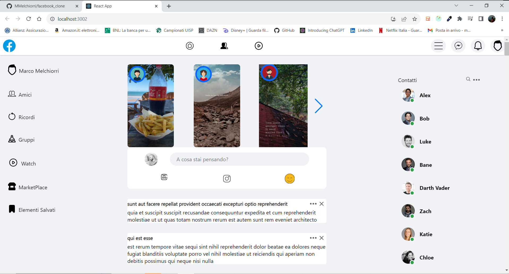

# Facebook Clone (Frontend-only with Axios)



This is a project that replicates the look and feel of the popular social networking platform, Facebook. The Facebook Clone (Frontend-only with Axios) project is designed for educational purposes and as a demonstration of web development skills. It does not include a backend, but it uses Axios to make API requests for frontend development practice.

## Table of Contents

1. [Introduction](#introduction)
2. [Features](#features)
3. [Technologies Used](#technologies-used)
4. [Installation](#installation)
5. [Usage](#usage)
6. [Making API Requests with Axios](#making-api-requests-with-axios)
7. [Contributing](#contributing)
8. [License](#license)

## Introduction

The Facebook Clone (Frontend-only with Axios) project is a web-based application that closely mimics the user interface and user experience of Facebook. While it doesn't include a functioning backend or database for user data, it utilizes Axios to make API requests for demonstrating frontend development skills.

## Features

- User interface resembling Facebook, including the news feed, user profiles, and post interactions.
- Demonstrates the use of Axios for making API requests, even without a real backend.
- An educational resource for understanding frontend development and API integration.

## Technologies Used

The Facebook Clone (Frontend-only with Axios) project uses the following technologies for frontend development:

- **HTML:** Structuring the web pages.
- **CSS:** Styling the user interface.
- **JavaScript:** Adding interactivity to the website.
- **Axios:** Making API requests to a backend (even if it's not included in this project).

## Installation

To run this project, simply open the `index.html` file in a web browser. No server or backend setup is required for the frontend part of the project.

## Usage

You can explore the static user interface that closely resembles Facebook by opening the `index.html` file in a web browser. Please note that this project does not include any backend functionality or user data storage.

## Making API Requests with Axios

Although this project doesn't have a real backend, it uses Axios to simulate API requests. You can find Axios requests in the JavaScript code, such as fetching posts or user information. These requests are for demonstration purposes only and do not interact with an actual server.

```javascript
axios.get('/api/posts')
  .then((response) => {
    // Handle the response data
  })
  .catch((error) => {
    // Handle any errors
  });
